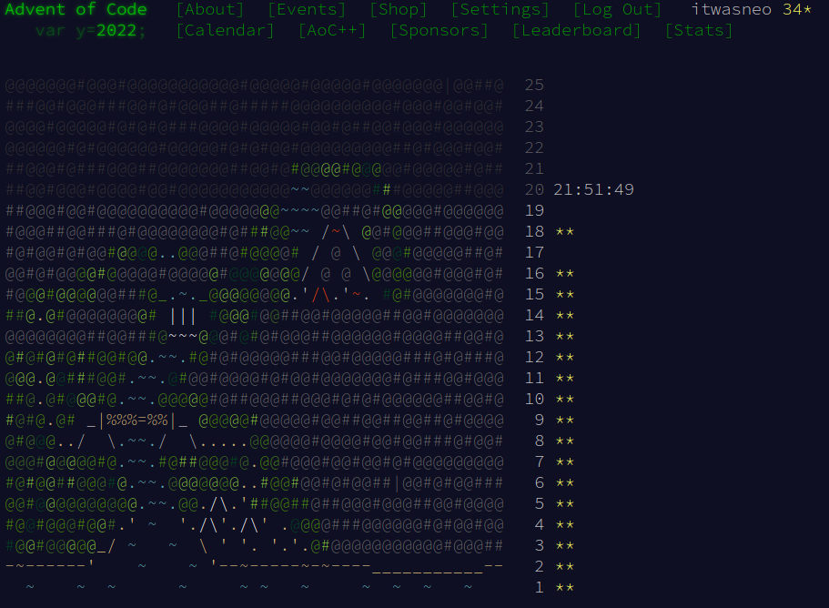

# advent-of-code-2022
This is my first year attending AOC. At first I was planning committing solutions for 3 different languages each day, but I couldn't stick to the plan. Right now,
I'm only submitting solutions in python, I will try to add solutions for java and rust when I find a chance.

## Disclaimer
Starting from day 15, my solutions started to get clumsier and clumsier. The problems were also going towards either DFS or BFS solutions each day, so I decided
to cut myself out, from this years advent of code. I won't try to commit daily solutions, but I'm planning to get back to it now and then. These were overall quality
problems.



## Rust solutions

Inside **rust-solution** directory run

```shell
cargo test tests -- --nocapture
```

## Python solutions

Inside **python-solutions** directory run

```shell
python3 test.py
```

## Java solutions

Inside **java-solutions** directory run

```shell
mvn test
```

## TODO
* [ ] Missing Java and Rust solutions
  * [ ] Day 3
  * [ ] Day 6
  * [ ] Day 7
  * [ ] Day 8
  * [ ] Day 9
  * [ ] Day 10
  * [ ] Day 11
  * [ ] Day 12
  * [ ] Day 13
  * [ ] Day 14
  * [ ] Day 15
  * [ ] Day 16
  * [ ] Day 17
  * [ ] Day 18
* [ ] Python solution for day 1 problem 2 is not correct.
* [ ] Python solution for day 15 is very inefficient.
* [ ] Python solution for day 16 part 2 needs some rethinking
* [ ] Python solutonn for day 17 is missing. Tetris implementation.
* [ ] Python solution for day 18 part 2 is missing. Flood fill algorithm.
